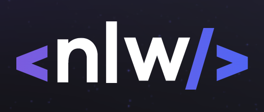

<p align="center">
  
</p>

<p align="center">
  
       
  

</p>

<h2 align="center">Tópicos 📋</h2>

   <p>
   
   - [Tecnologias 🚀](#tecnologias-)
   - [Sobre 📖](#sobre-)
   - [Layout 🎨](#layout-)
   - [Arquivos no Notion 📋](#arquivo-no-notion-)
   - [Como Usar 🤔](#como-usar-)

   </p>

---


<h2 align="center">Tecnologias 🚀</h2>

<p>
Esse projeto foi desenvolvido com as seguintes tecnologias:

- Flutter
- Getx
- dart

</p>

---

<h2 align="center">Sobre 📖</h2>
   
<p>
   O projeto PayFlow foi desenvolvido na Next Level Week Together 💜💚 pela Rocketseat<br>
   No meu projeto PayFlow eu desenvolvi usando o Getx para gerenciar o estado da minha aplicação, para estudo e uso em projetos futuros
</p>

---

<h2 align="center">Layout 🎨</h2>

   <p align="center">
      
   </p>
   - <a href="https://www.figma.com/file/kLK7FYnWKMoN68sQXcSniu/PayFlow">Mobile</a> 📱
   </p>

---

<h2 align="center">Arquivo no Notion 📋</h2>

- [Trilha | Flutter](https://www.notion.so/NLW-Together-Conte-dos-complementares-ae22125e899549efb2d4e360b5ee5ca3) 🚀

---

<h2 align="center">Como Usar 🤔</h2>

   ```
   - Clone esse repositório:
   $ git clone https://github.com/alexandref13/nlw6-payflow-flutter
   - Entre no diretório:
   $ cd nlw6-payflow-flutter
   - Instale as dependências:
   $ flutter pub get
   - Inicie o app: 
   $ flutter run
   ```

---

   >Esse projeto foi desenvolvido com ❤️ na #NextLevelWeekTogether da **[Rocketseat  💜🚀](https://rocketseat.com.br/)**.<br> 
   **[Participe da nossa Comunidade! 👋](https://discordapp.com/invite/gCRAFhc)**.<br>
---

   <p align="center">
      
   </p>